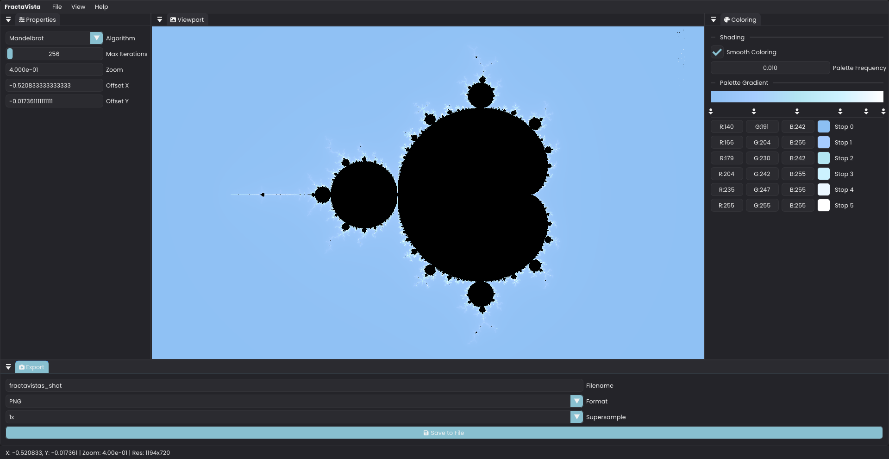

# 🎨 FractaVista
[](https://codescene.io/projects/67817)
[](https://www.codefactor.io/repository/github/krish2882005/fractavista)


**A modern, GPU-accelerated fractal explorer built with C++ and OpenGL.**

> **Note: This is a work in progress. New features are being added and existing ones may be refined.**

FractaVista is a high-performance, interactive desktop application for exploring the mesmerizing beauty of fractals. It leverages modern C++ and the power of GPU compute shaders to deliver a smooth, real-time exploration experience with an intuitive user interface.

<p align="center">
  
</p>

---

## ✨ Features

- **GPU-Accelerated Rendering**: Utilizes OpenGL compute shaders for blazingly fast fractal generation, allowing for deep, real-time exploration.
- **Multiple Fractal Algorithms (more to be added soon)**: Comes with several built-in fractal types:
  - Mandelbrot
  - Julia
  - Burning Ship
  - Cubic Mandelbrot
  - Tricorn
  - Newton
- **Interactive Navigation**: Smoothly pan and zoom into the intricate details of each fractal with simple mouse controls.
- **Real-time Parameter Control**: Tweak parameters like max iterations, zoom, position, and Julia set constants on the fly.
- **High-Resolution Export**: Save stunning, high-quality screenshots of your discoveries with built-in supersampling options (up to 8x).
- **Modern & Modular Codebase**: Written in clean, modern C++ with a strong emphasis on modularity.

## 🛠️ Technology Stack

- **Language**: C++
- **Graphics API**: OpenGL 4.3+
- **Windowing & Input**: [SDL3](https://github.com/libsdl-org/SDL)
- **GUI**: [Dear ImGui](https://github.com/ocornut/imgui)
- **OpenGL Loading**: [GLAD](https://glad.dav1d.de/)
- **Image Loading/Saving**: [SDL3_image](https://github.com/libsdl-org/SDL_image)
- **Math**: [GLM](https://github.com/g-truc/glm)
- **JSON Parsing**: [nlohmann/json](https://github.com/nlohmann/json)
- **File Dialogs**: [Native File Dialog](https://github.com/mlabbe/nativefiledialog)
- **Logging**: [spdlog](https://github.com/gabime/spdlog)


## 🚀 Getting Started

### Prerequisites

- A C++ compiler that supports C++ 17 or newer (GCC, Clang, MSVC).
- [CMake](https://cmake.org/) (version 3.16 or higher).
- The following libraries installed on your system:
  - [SDL3](https://github.com/libsdl-org/SDL)
  - [SDL3_image](https://github.com/libsdl-org/SDL_image)
  - [Dear ImGui](https://github.com/ocornut/imgui)
  - [GLM](https://github.com/g-truc/glm)

### Building

1.  **Clone the repository:**
    ```bash
    git clone https://github.com/Krish2882005/FractaVista.git
    cd FractaVista
    ```

2.  **Create a build directory:**
    ```bash
    mkdir build
    cd build
    ```

3.  **Configure the project with CMake:**
    ```bash
    cmake ..
    ```

4.  **Build the project:**
    ```bash
    cmake --build .
    ```

5.  **Run the application:**
    The executable `FractaVista` will be located in the `build` directory.

## 🕹️ How to Use

- **Pan**: Click and drag with the left mouse button to move around the fractal.
- **Zoom**: Use the mouse scroll wheel to zoom in and out.
- **Controls Window**:
  - Use the **Algorithm** dropdown to switch between different fractal types.
  - Adjust sliders and input fields to change fractal parameters in real-time.
  - Use the **Export** section to save a PNG image of the current view.

## 🔮 Future Roadmap

- [ ] Implement more fractal algorithms (e.g., Nova, Magnet).
- [ ] Add customizable color palettes and color smoothing.
- [ ] Implement keyframe animation to export videos of fractal zooms.
- [ ] Display performance metrics (render time, FPS) in the UI.

## 📄 License

This project is licensed under the MIT License.
